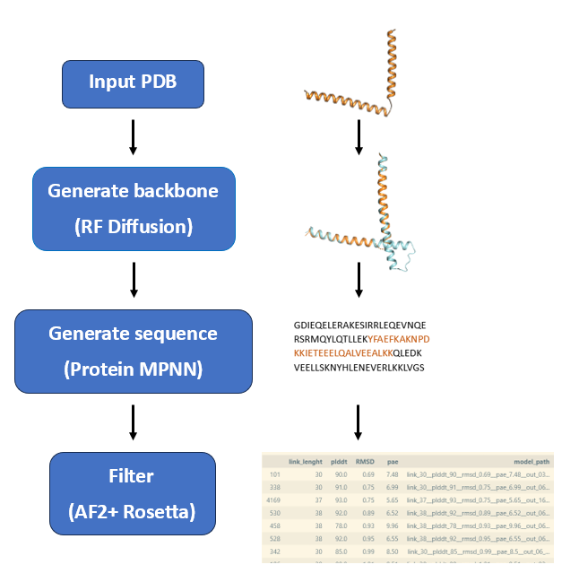

# prosculpt
Protein design and sculpting using Rosetta and Deep learning methods (RFDiff and Alphafold2)


## Description 
The script `rfdiff_mpnn_af2_merged.py` runs a pipeline to automate the processes of generating protein structures with RFdiffusion, sequence generation with ProteinMPNN, and folding and evaluation with AF2 and Rosetta. Specifically, the script uses motif scaffolding to generate structures (see [RFdiffusion github repository](https://github.com/RosettaCommons/RFdiffusion/blob/main/README.md)).

The main steps are as follows:
1. The main inputs are a protein PDB file and a string that specifies how to generate the new structure around the original protein (which parts to keep, etc.) - this string is called a contig. 
2. The RFdiffusion module generates new protein structures (backbone atoms only) based on the contig provided.
4. Generated PDB files are preprocessed using helper scripts and ProteinMPNN generates sequences (aminoacid residues) for these structures.
5. Sequences are prepared for the AF2, which folds them into structures.
6. Additional evaluation parameters are calculated for these structures using a separate script with Rosetta.
7. The final output is a CSV file containing AF2 structure path, evaluation parameters etc.

## Requirements  
The script requires the prosculpt package. It assumes that RFdiffusion, proteinMPNN, and AF2 are installed and that the correct paths are provided in the `installation.yaml` config file. Additionall biopython, hydra-core, pandas and scipy and pyRosetta are required.  

For running tests, Python version must be >= 3.7 (it needs the `capture_output` arg).

## Installation
The easiest way to install prosculpt is using a container manager like [apptainer](https://apptainer.org/) (or singularity). To do so, follow these instructions

Begin by cloning prosculpt:
```bash
git clone https://github.com/ajasja/prosculpt.git
cd prosculpt
```
Create a new conda environment called prosculpt (or any name of your choice) and activate it:
```bash
python -m venv prosculpt_venv/
source prosculpt_venv/bin/activate
```
Install it and its dependencies
```bash
pip install .
```
Install pyrosetta into the environment
```bash
pip install pyrosetta-installer 
python -c 'import pyrosetta_installer; pyrosetta_installer.install_pyrosetta()'
```
At a location of your choice download the appropriate SIF files, executing the following commands:
```bash
singularity pull rfdiff.sif docker://rosettacommons/rfdiffusion
singularity pull proteinmpnn_jysgro.sif docker://jysgro/proteinmpnn
singularity pull colabfold.sif docker://unionbio/colabfold:w4KMVR7WrKDlCbdQ1BYrjQ-test
singularity pull pymol.sif docker://jysgro/pymol:3.1.0_amd_arm
```
Go into prosculpt/config/installation.yaml and replace the run command of the sif files with the appropriate commands and paths for your system.
Also replace the prosculpt_python_path with the python path of your prosculpt env (You can get it by running "which python" with the env active)

Now we will run a single test, to allow colabfold to download the weights by executing: (This step uses slurm. If your system doesn't use slurm, just run prosculpt by yourself once)
```bash
python run_tests.py unconditional
```
After this has succesfully ran, you can run all tests by executing:
```bash
python run_tests.py
```

After all tests are finished, go into the Examples/Examples_out_{yourdatetime} and check the output txt file to verify all tests have passed. 


## Usage
To run Prosculpt on Slurm, use the `slurm_runner.py` with the following positional arguments:
* `number of concurrent jobs to run`
* `slurm job name`
* `any arguments to be passed to the _merged script` (output_dir, contig, ++additionalArguments ...)

If you want to run Prosculpt locally, run the `rfdiff_mpnn_af2_merged.py` directly and modify args as needed.

### Example: unconditional monomer
Let's use slurm_runner to create 1 task named "Unconditional", set output directory and a simple contig that will generate 150 residues.
```bash
python slurm_runner.py 1 Unconditional output_dir="out/uncond" "contig=\[150-150\]"
```

### Example: nickel symmetric motif
```bash
python slurm_runner.py 2 testniNikelj output_dir=ZZtest/IZ_PAJPLAJNA/nikelj "contig=\[50/A2-4/50/0 50/A7-9/50/0 50/A12-14/50/0 50/A17-19/50/0\]" pdb_path="/home/tsatler/RFdif/RFdiffusion/examples/input_pdbs/nickel_symmetric_motif.pdb" num_designs_rfdiff=1 num_seq_per_target_mpnn=1 af2_mpnn_cycles=1 ++inference.symmetry="C4" ++inference.num_designs=2 '++potentials.guiding_potentials=["type:olig_contacts,weight_intra:1,weight_inter:0.06"]' ++potentials.olig_intra_all=True ++potentials.olig_inter_all=True ++potentials.guide_scale=2 ++potentials.guide_decay="quadratic" ++inference.ckpt_override_path=/home/tsatler/RFdif/RFdiffusion/models/Base_epoch8_ckpt.pt
```

### Passing additional parameters
Please note that the arguments to be passed forward to RfDiff need to be prefixed with `++`.

## Running using config files
You can use `run.yaml` config file for all the arguments (add `-cd directoryOfYourConfigFile -cn configFilenameWithoutExtension` as **the last two** arguments).

### Example: passing the args through a config file
In the folder `mySuperNewProtein`, you have the config (based on run.yaml) named `rHelix5.yaml`. 
```bash
python slurm_runner.py 2 helix output_dir=some/dir -cd mySuperNewProtein -cn rHelix5
```

You can also combine the config file and command line arguments:
```bash
python slurm_runner.py 2 helix output_dir=some/dir "contig=\[C33-60/4-7/A1-30/0 B61-120\]" -cd mySuperNewProtein -cn rHelix5
```

## Skipping RfDiff
Sometimes you may want to skip RfDiff and only pass the pdb to ProteinMPNN and AF with a few residues to change. 

Add `skipRfDiff: True` and `designable_residues: [A8, A9, A10, A13, A85, B, C]` to the yaml config, where designable_residues contains the residues you want to change **and** all chain letters you want in your output pdb.

In order to actually produce diverse results, `--sampling_temp` and `--backbone_noise` passed to ProteinMPNN are increased to `0.3` and `1`, respectively.  
_TODO: Make this configurable (maybe a similar trick to how we create a config file for RfDiff, pass it to ProteinMPNN)._

## Working with natural proteins
Natural proteins require AF2 to work with multiple sequence alignments. In order to obtain good results when working with natural proteins, the option "use_a3m" needs to be set to True. This option requires MSAs for each chain in the reference structure. To obtain these MSAs just run each chain in the reference structure separately through AF2 and use the A3M file it produces. Each file needs to contain within the name "Chain_X" where X is the chain ID of the corresponding chain in the reference structure file. These alignment files need to be placed together in a directory and the "a3m_dir" option needs to be set to this directory in the yaml config file or passed through command line. 

Prosculpt generates new "partial alignment" files for each design where natural proteins are modelled using MSAs and designed proteins (or designed portions of hybrid proteins) are not.

## Inputs: 
Most input parameters are documented in the `run.yaml` config file. However, here's some additional info about them:
- `python`: for running the script you need the python from the.venv environment. Replace `python` with `/home/nbizjak/projects/11_04_2023_rigid_connections/.venv/bin/python`
- `original_pdb_path`: original PDB around which the new structure is generated
- `contig`: explained in detail in the [RFdiffusion github repository](https://github.com/RosettaCommons/RFdiffusion/blob/main/README.md).
    - Please note: The whole argument must be enclosed in double quotes and square brackets must be escaped with a backslash! `"contig=\[150-150\]"`
- `output_dir`: output directory. Along the pipeline, each module will create its own subdirectory. The AF2 models are in the end renamed and copied to a subdirectory called `final_pdbs` 
- `num_designs_rfdiff`: number of structures generated by RFdiffusion
- `num_seq_per_target_mpnn`: number of sequences generated per one RFdiffusion structure (each sequence is by default folded 5 separate times by AF2)
- `chains_to_design_mpnn`: list chains for which MPNN should generate the sequence. If not specified, it will be assigned automatically based on contig (where `/0 ` denotes a chain break). If you have specific needs, specify it manually.

If symmetry is needed in the design process, add the argument `symmetry` which specifies the type of symmetry and equals the number of peptides in the symmetrical complex. Important: symmetry must equal the number of chains to design in the `contig` and `chains_to_design_mpnn` arguments.  

A note on outputs: when running on a cluster for each task a separate `final_outputs.csv` will be create. Run `merge_csv.py` along with the argument `--output_dir` to merge all csv files into one file.

## Passing additional arguments to ProteinMPNN
Add parameters as required by ProteinMPNN to the `pass_to_mpnn` group in run.yaml (including trailing `--`).

## Passing additional arguments to AlphaFold
Add parameters as required by AlphaFold to the `pass_to_af` group in run.yaml (including trailing `--`). Switches should be passed with an empty string value, like this `--templates: ""`. 


## Examples for contigs
Contigs are the most important input (for now, guiding potentials are another input to be explored in the future). Here are a few guidelines to ease the start of your projects.
- Ranges starting with letters will be taken from the input.pdb
- Ranges without letters will generate that many residues
- `/0 ` (mind the space!) will create a chain break
- For connecting two parts, you could use a contig such as this: `'[A1-37/30-60/A42-70]'`. If the original PDB has another chain B, it will not be given to RFdiffusion in this case.
- For connecting two parts with respect to another structure: `'[C33-60/4-7/B1-30/0 C61-120]'`. Chain B is given to RFdiffusion but no new structures are generated on it. Note: in the generated structure PDB, the chains will be labeled as A (connected A and B) and B (C in original). 
- For connecting multiple chains: `'[E10-68/5-15/C4-72/5-15/D78-145/5-15/A1-60/]'`
- For leveraging symmetry: `'[10/A29-41/10/0 10/B29-41/10/0 10/C29-41/10]'`. In this case, the additional symmetry parameter must be: `symmmetry=C3` (three subunits). Also, you cannot use contigs with interval lengths to be generated e.g. `'[10-20/A29-41/10-20]'`. Symmetry is not good enough for now, it needs some debugging in the MPNN module and optimization in guiding potentials of RFdiffusion.
- Important: if you wish to force a number of newly generated residues, pass it as range: `[A1-7/3-3/A11-12/1-1/A14-84/1-1/A86-96]` (and not `[A1-7/3/A11-12/1/A14-84/1/A86-96]`)
- More info is available in the [RFdiff repo](https://github.com/RosettaCommons/RFdiffusion/blob/main/README.md#motif-scaffolding).

## Automatic restart on 3rd-party crash
Prosculpt uses 3rd-party software (RfDiffusion, ProteinMPNN, AlphaFold). Sometimes, especially if running hundreds of samples, this software may fail, exiting with an error code.  
Previously, Prosculpt detected this and fatally crashed to avoid file loss. However, sometimes it may be handy to let it automatically restart Prosculpt and continue from where it left. (Useful if your HPC node becomes so slow AF decides to throw an error; reinitiating it may fix the issue).

To do so, pass `auto_restart: n`, where `n` ... number of allowed restarts, to the .yaml config.

## Excluding broken HPC nodes
Sometimes, some HPC nodes get broken, work very slow or just throw _command not found_ or _no such file or directory_ errors. To avoid wasting time on them, you can [exclude](https://slurm.schedmd.com/sbatch.html#OPT_exclude) the tasks from being scheduled to them.

For this, create a file `config/hpc_exclude_nodes.txt` (that is, in the same directory as your `installation.yaml` config) with the [NodeList](https://wiki.fysik.dtu.dk/Niflheim_system/Slurm_operations/#expanding-and-collapsing-host-lists) of broken nodes.  
Example: `compute-3-20,compute-0-21,compute-6-[0-3]`.  
_Note: all node names must be valid, otherwise Slurm will throw an error. Additionally, do not exclude all possible nodes, for no nodes will be available to perform your task._

